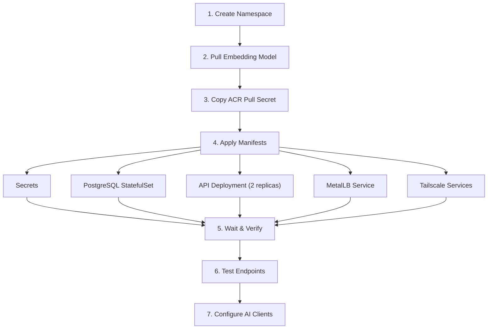

# Open Brain - Self-Hosted Kubernetes Deployment

> Tailored for the homelab: 3-node K8s cluster with Tailscale, Cloudflare, MetalLB, and Ollama.

---

## Your Cluster At a Glance

| Component | Details |
|---|---|
| **Nodes** | 3x `node-{1,2,3}` — 32 CPU / 96GB RAM each |
| **OS** | Ubuntu 24.04.4 LTS, K8s v1.31.14, containerd 1.7.28 |
| **CNI** | Flannel (vxlan), pod CIDR 10.244.x.0/24 |
| **Load Balancer** | MetalLB — IP pool on 192.168.x.x |
| **Ingress** | ingress-nginx |
| **Storage** | local-path provisioner → `/mnt/k8s-data/` |
| **DNS** | Cloudflare (namespace: `cloudflare`) |
| **VPN** | Tailscale (namespace: `tailscale`) |
| **TLS** | cert-manager (namespace: `cert-manager`) |
| **Existing DB** | Citus PostgreSQL (coordinator + 3 workers + 2 standby) |
| **Existing Cache** | Redis 3-replica HA with Sentinel |
| **Existing Messaging** | NATS 3-replica |
| **Service Mesh** | Dapr 1.16.3 (dapr-system namespace) |
| **Monitoring** | Prometheus HA, Grafana HA, Loki HA, Elasticsearch |
| **AI** | Ollama GPU Bridge at `ollama-gpu-bridge:11434` (llama3.2) |
| **App namespace** | `your-namespace` (existing app) |

---

## Architecture for Open Brain on Your Cluster

```
┌─────────────────────────────────────────────────────────────────────┐
│  K8s Cluster: node-{1,2,3}                              │
│                                                                     │
│  Namespace: openbrain                                               │
│  ┌─────────────────────────────────────────────────────────────┐   │
│  │                                                              │   │
│  │  ┌─────────────────┐  ┌──────────────────────────────────┐  │   │
│  │  │  PostgreSQL      │  │  open-brain-api                  │  │   │
│  │  │  + pgvector      │  │  (Node/TS + Hono)                       │  │   │
│  │  │                  │  │                                   │  │   │
│  │  │  StatefulSet     │  │  - REST API (:8000)              │  │   │
│  │  │  1 replica       │  │  - MCP server (:8080)            │  │   │
│  │  │  PVC: 10Gi       │  │  - Capture + Search + Stats     │  │   │
│  │  │  local-path      │  │                                   │  │   │
│  │  └────────┬─────────┘  │  Deployment, 2 replicas          │  │   │
│  │           │             │  (SessionAffinity: ClientIP)     │  │   │
│  │           │             └──────────┬───────────────────────┘  │   │
│  │           │                        │                          │   │
│  │           └────────────────────────┘                          │   │
│  │                                                               │   │
│  │  ┌──────────────────────────────────────────────────────────┐ │   │
│  │  │  Shared from your-namespace (cross-namespace access)      │ │   │
│  │  │                                                           │ │   │
│  │  │  • ollama-gpu-bridge:11434  (embeddings + LLM)           │ │   │
│  │  │  • prometheus-ha            (metrics scraping)           │ │   │
│  │  │  • grafana-ha               (dashboards)                 │ │   │
│  │  │  • loki-ha                  (log aggregation)            │ │   │
│  │  └──────────────────────────────────────────────────────────┘ │   │
│  └──────────────────────────────────────────────────────────────┘   │
│                                                                     │
│  External Access:                                                   │
│  ┌──────────────────────────────────────────────────────────────┐   │
│  │  MetalLB LoadBalancer → 192.168.x.x (MCP + API)          │   │
│  │  Tailscale → Private access from your devices               │   │
│  │  Cloudflare Tunnel → brain.yourdomain.com (public MCP)      │   │
│  └──────────────────────────────────────────────────────────────┘   │
└─────────────────────────────────────────────────────────────────────┘
```

---

## What's Different from Nate's Supabase Version

| Nate's Stack | Your Self-Hosted Stack | Why |
|---|---|---|
| Supabase PostgreSQL | Dedicated PostgreSQL + pgvector pod | Full control, same cluster |
| Supabase Edge Functions (Deno) | Node.js + Hono (TypeScript) | Same language family as Nate's Deno, full MCP SDK |
| OpenRouter API | Ollama (`ollama-gpu-bridge:11434`) | Free, private, already running |
| `text-embedding-3-small` (1536-dim) | `nomic-embed-text` or `mxbai-embed-large` (768-1024 dim) | Local GPU, zero cost |
| `gpt-4o-mini` (metadata) | `llama3.2` via Ollama | Already configured in your MCP server |
| Supabase Dashboard | pgAdmin (existing) | Self-hosted UI |
| Supabase RLS | PostgreSQL native RLS | Same mechanism, you control policies |
| `?key=` URL auth | Kubernetes Secrets + Tailscale ACLs | Network-level + app-level auth |

---

## Key Advantage: Ollama Is Already Running

Your existing MCP server deployment already references Ollama:

```yaml
# From your your-mcp-server-deployment.yaml
- name: Ollama__Endpoint
  value: "http://ollama-gpu-bridge:11434"
- name: Ollama__Enabled
  value: "true"
- name: Ollama__DefaultModel
  value: "llama3.2"
```

Open Brain will use the **same Ollama instance** for:
1. **Embeddings**: `nomic-embed-text` model (768-dim vectors) — pull once, use forever
2. **Metadata extraction**: `llama3.2` — already loaded

Cross-namespace access: `http://ollama-gpu-bridge.your-namespace.svc.cluster.local:11434`

---

## Deployment Steps

Each step creates a specific piece of the system. Here's the order and why it matters:



### Step 1: Create Namespace

Isolates all Open Brain resources from your other workloads. The security label allows the pods to run with the permissions they need.

```bash
kubectl create namespace openbrain
kubectl label namespace openbrain pod-security.kubernetes.io/enforce=privileged
```

### Step 2: Pull Ollama Embedding Model

Downloads the `nomic-embed-text` model into your existing Ollama instance. This model converts text into 768-dimensional vectors for semantic search. It only needs to be pulled once.

```bash
# Exec into Ollama pod and pull the embedding model
kubectl exec -n your-namespace deploy/ollama-gpu-bridge -- ollama pull nomic-embed-text
```

### Step 3: Copy ACR Pull Secret

Your API container image lives in Azure Container Registry. This copies your existing pull credentials into the new namespace so K8s can pull the image.

```bash
# Copy the existing ACR pull secret from your-namespace to openbrain namespace
kubectl get secret acr-pull-secret -n your-namespace -o yaml \
  | sed 's/namespace: your-namespace/namespace: openbrain/' \
  | kubectl apply -f -
```

### Step 3a: Build and push the image, then substitute it

`openbrain-api-deployment.yaml` pins a private ACR image that only this project's
maintainer can pull. Nothing builds it for you — CI publishes to GHCR, which is not
where this manifest points — so applying the file unedited gives `ImagePullBackOff`
or `ErrImagePull`.

```bash
TAG=$(date -u +%Y%m%d-%H%M%S)
REGISTRY=your-registry.azurecr.io          # the one whose pull secret you copied above

az acr login --name "${REGISTRY%%.*}"
docker build -t "$REGISTRY/openbrain/api:$TAG" .
docker push "$REGISTRY/openbrain/api:$TAG"

sed -i "s|image: .*/openbrain/api:.*|image: $REGISTRY/openbrain/api:$TAG|" \
  deploy/on-prem/k8s/openbrain-api-deployment.yaml
```

Dated tags rather than `:latest`, so a rollback is `kubectl rollout undo` and a
running pod's image says which build it is.

**Upgrading an existing install?** Do not re-apply the whole manifest -- it would
also overwrite any live tuning of replicas or resource limits. Just move the
image:

```bash
kubectl -n openbrain set image deployment/openbrain-api openbrain-api="$REGISTRY/openbrain/api:$TAG"
kubectl -n openbrain rollout status deployment/openbrain-api
```

### Step 4: Apply Manifests

Apply the Kubernetes resources in dependency order. The session affinity patch is critical — without it, MCP SSE connections can break when requests land on different pods.

```bash
# From E:\GitHub\OpenBrain\k8s\ directory
kubectl apply -f k8s/namespace.yaml
kubectl apply -f k8s/openbrain-secrets-actual.yaml   # Your actual secrets (gitignored)
kubectl apply -f k8s/postgres-statefulset.yaml
kubectl apply -f k8s/openbrain-api-deployment.yaml
kubectl apply -f k8s/openbrain-api-service-metallb.yaml
kubectl apply -f k8s/openbrain-tailscale-service.yaml    # Tailscale MagicDNS (tailnet only)
kubectl apply -f k8s/openbrain-funnel-ingress.yaml       # PUBLIC HTTPS via real Funnel
# k8s/openbrain-tailscale-funnel.yaml is RETIRED - superseded by the Ingress above

# Enable session affinity on the ClusterIP service (required for multi-replica SSE)
kubectl patch svc openbrain-api -n openbrain \
  -p '{"spec":{"sessionAffinity":"ClientIP","sessionAffinityConfig":{"clientIP":{"timeoutSeconds":3600}}}}'
```

> **`openbrain-tailscale-funnel.yaml` is retired** and no longer applied. It
> never enabled Funnel, despite the name and the `tailscale.com/funnel: "true"`
> annotation. The operator honours that annotation on an **Ingress** with
> `ingressClassName: tailscale`, not on a LoadBalancer Service. On a Service it
> creates a tailnet device and DNATs the port, with no `tailscale serve` config
> — and Funnel requires one.
>
> Consequences worth knowing, because they mislead in both directions:
>
> - it was reachable from the **tailnet only**, never the public internet
> - nothing terminated TLS, so it spoke plain HTTP on port 443:
>   `http://<host>.<tailnet>.ts.net:443/` worked and `https://…` always failed.
>   Any client building an `https://` URL against it could never have worked.
> - the operator appends a suffix when a hostname is taken, so its device came up
>   as `openbrain-1` rather than `openbrain`
>
> Verify the distinction with
> `kubectl exec -n tailscale <proxy-pod> -c tailscale -- tailscale serve status`.
> `No serve config` means no Funnel.
>
> **`openbrain-funnel-ingress.yaml` is the form that works.** The same command
> reports `Funnel on`, TLS is terminated for you, and one hostname serves both
> the tailnet and the public internet — which removes the need for clients to
> switch endpoints depending on where they are.
>
> ⚠ It is a **public internet** endpoint. Since 0.8.0 the server refuses to boot
> with no key configured (no rows in `access_keys` and no `MCP_ACCESS_KEY`), so
> it cannot silently become an open memory store. Still confirm `/sse` returns
> **401** without a key. `/health` is unauthenticated by design and returns only
> a status string.

### Step 5: Wait and Verify

```bash
# Wait for postgres to be ready (init.sql runs automatically via ConfigMap)
kubectl wait --for=condition=ready pod -l app=openbrain-postgres -n openbrain --timeout=120s

# Wait for API pods
kubectl wait --for=condition=ready pod -l app=openbrain-api -n openbrain --timeout=120s

# Check all pods
kubectl get pods -n openbrain

# Check services (MetalLB + Tailscale)
kubectl get svc -n openbrain
```

### Step 6: Test Endpoints

```bash
# Via MetalLB (LAN)
curl -s http://192.168.x.x:8000/health
curl -s http://192.168.x.x:8080/health

# Via Tailscale MagicDNS (anywhere on your tailnet)
curl -s http://openbrain.tailfb4202.ts.net:8000/health
curl -s http://openbrain.tailfb4202.ts.net:8080/health

# Via Tailscale Funnel (public HTTPS, from any network)
curl -s https://openbrain.tailfb4202.ts.net/health

# Test MCP SSE auth
curl -s "https://openbrain.tailfb4202.ts.net/sse?key=YOUR_MCP_KEY" --max-time 2
```

### Step 7: Configure AI Clients

See [04-MCP-SERVER.md](04-MCP-SERVER.md) for client configs. Use these URLs:

| Client | Network | URL |
|---|---|---|
| Claude Code / Cursor (SSE) | Tailscale | `http://openbrain.tailfb4202.ts.net:8080/sse?key=<KEY>` |
| Claude Code / Cursor (SSE) | LAN | `http://192.168.x.x:8080/sse?key=<KEY>` |
| Claude Code / Cursor (SSE) | Public (Funnel) | `https://openbrain.tailfb4202.ts.net/sse?key=<KEY>` |
| Claude Desktop (mcp-remote) | Any network | `npx -y mcp-remote https://openbrain.tailfb4202.ts.net/sse?key=<KEY>` |

---

## Networking Options

### Option A: Tailscale MagicDNS (Private, Anywhere) ✅ Active

Access Open Brain from **any device on your Tailscale network**, anywhere in the world.
Uses the Tailscale K8s Operator with a `loadBalancerClass: tailscale` service.

```
Any device on your tailnet (laptop, phone, tablet, other servers)
  → http://openbrain.tailfb4202.ts.net:8000  (REST API)
  → http://openbrain.tailfb4202.ts.net:8080  (MCP SSE)
```

- **Tailscale IP**: `100.118.118.101`
- **MagicDNS**: `openbrain.tailfb4202.ts.net`
- **Encryption**: WireGuard tunnel (end-to-end encrypted, no TLS certs needed)
- **Auth**: MCP access key still required for MCP endpoints

### Option B: MetalLB LAN (Local Network) ✅ Active

Access from devices on your home network.

```
Devices on LAN
  → http://192.168.68.120:8000  (REST API)
  → http://192.168.68.120:8080  (MCP SSE)
```

### Option C: Tailscale Funnel (Public HTTPS) ✅ Active

Exposes OpenBrain MCP to the **public internet** over HTTPS via Tailscale Funnel.
Required for devices **not** on your tailnet (e.g. a work PC without Tailscale installed).

```
Any device on the internet
  → https://openbrain.tailfb4202.ts.net  (MCP SSE, port 443)
```

- **TLS**: Automatically provisioned by Tailscale
- **Port**: 443 only (Funnel limitation)
- **Auth**: MCP access key still required
- **K8s manifest**: `k8s/openbrain-tailscale-funnel.yaml`

**Prerequisites:**
1. Tailscale K8s Operator installed
2. HTTPS certificates enabled in Tailscale Admin Console (DNS → HTTPS Certificates)
3. Funnel enabled in tailnet ACL policy:
   ```jsonc
   "nodeAttrs": [{ "target": ["tag:k8s"], "attr": ["funnel"] }]
   ```

**Important:** The Tailscale K8s Operator (v1.92.4) creates the proxy pod but does **not** auto-configure Funnel serve. After applying the manifest, you must manually enable it:
```bash
# Find the Funnel proxy pod
kubectl get pods -n tailscale | grep openbrain-funnel

# Enable Funnel serve (replace pod name with actual)
kubectl exec -n tailscale ts-openbrain-funnel-<ID>-0 -c tailscale -- \
  tailscale funnel --bg --https=443 http://openbrain-api.openbrain.svc.cluster.local:8080
```
If the Funnel proxy pod restarts, you'll need to re-run this command.

**Note:** Claude Desktop does not support SSE transport directly. Use `mcp-remote` as a stdio-to-SSE bridge:
```json
{
  "mcpServers": {
    "openbrain": {
      "command": "npx",
      "args": ["-y", "mcp-remote", "https://openbrain.tailfb4202.ts.net/sse?key=<KEY>"]
    }
  }
}
```

### Option D: Cloudflare Tunnel (Public MCP, Optional)

Alternative to Funnel if you want a custom domain. Generally not needed now that Funnel is active.

```
Claude Desktop / ChatGPT
  → https://brain.yourdomain.com (Cloudflare Tunnel)
  → Cloudflare namespace → ingress-nginx → openbrain-api service
```

Create a Cloudflare Tunnel pointing to the ClusterIP service:
```yaml
# In your cloudflare tunnel config
- hostname: brain.yourdomain.com
  service: http://openbrain-api.openbrain.svc.cluster.local:8080
```

---

## Monitoring Integration

Your existing Prometheus + Grafana + Loki stack can monitor Open Brain:

### Prometheus Scraping

The API deployment includes Prometheus annotations:
```yaml
annotations:
  prometheus.io/scrape: "true"
  prometheus.io/port: "8000"
  prometheus.io/path: "/metrics"
```

### Grafana Dashboard

Import a Node.js/Hono dashboard or create custom panels for:
- Request rate to `/memories/search` and `/memories` endpoints
- Embedding generation latency (Ollama round-trip)
- PostgreSQL query duration
- Thought capture rate

### Loki Log Aggregation

Pod logs auto-collected by your existing Loki setup. Filter by:
```
{namespace="openbrain", app="openbrain-api"}
```

---

## Cost

| Component | Cost |
|---|---|
| PostgreSQL pod | ~256Mi RAM, 100m CPU (from your existing pool) |
| API pod (x2) | ~512Mi RAM, 200m CPU total |
| Ollama (shared) | Already running |
| Storage (10Gi PVC) | Local disk |
| Network (Tailscale/Cloudflare) | Already running |
| **Total** | **$0/month** (all self-hosted) |

---

## Comparison: Supabase vs Your Homelab

| Aspect | Supabase Free Tier | Your Homelab |
|---|---|---|
| Database | 500MB, shared infra | Unlimited, dedicated |
| Edge Function invocations | 500K/month | Unlimited |
| Embedding cost | $0.02/M tokens (OpenRouter) | $0 (Ollama local) |
| LLM metadata cost | $0.15/M tokens (gpt-4o-mini) | $0 (llama3.2 local) |
| Latency | Cloud round-trip | Local network (~1ms) |
| Privacy | Data on Supabase servers | Data never leaves your network |
| Uptime | Supabase SLA | Your responsibility |
| **Monthly cost** | **$0.10-$0.30** | **$0** |
